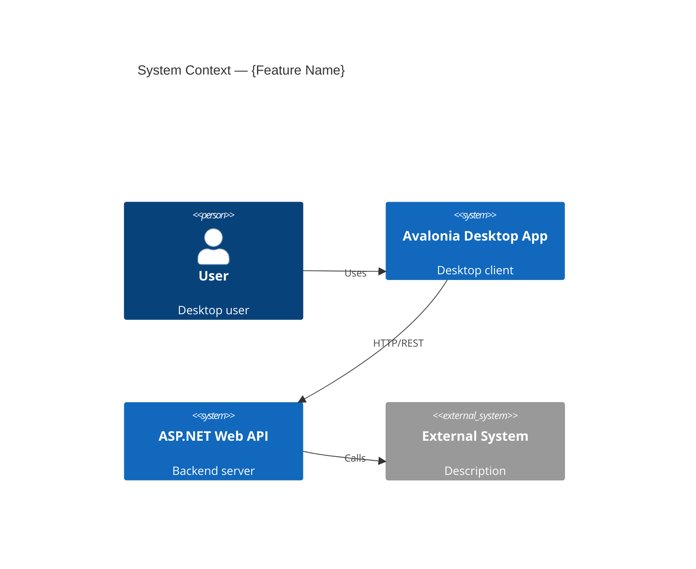
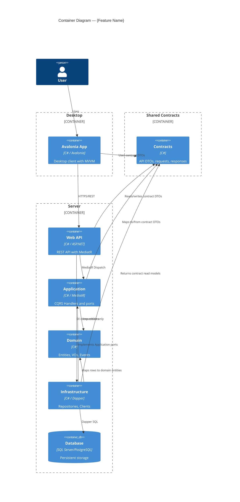
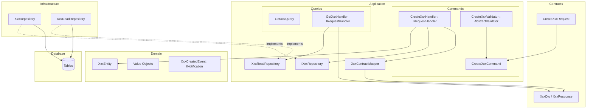
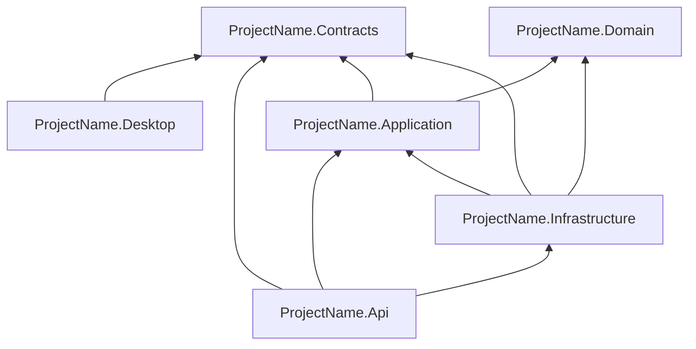
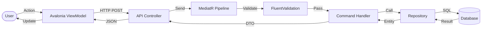
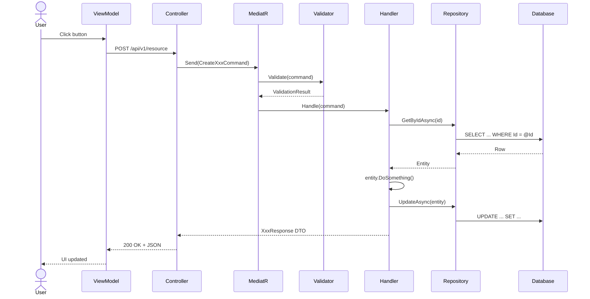

# Design Feature — C4 + DFD + Sequence → Code Plan

You are an expert software architect designing a feature for a C# solution (Avalonia desktop + ASP.NET Web API with MediatR/CQRS and Dapper) using the C4 model with human-in-the-loop approval.

**Core principle:** Design WHAT and WHY before HOW. No code planning until architecture is approved.

## CODEX COMMAND BOUNDARY

This skill replaces the old Claude slash command `/design-feature`. When invoked through `$design-feature` or `/design-feature`, treat the current turn as a bounded feature-design command invocation, not as a general coding request.

The active Codex root agent may write design artifacts and orchestrate the `architect-reviewer` custom agent, but it MUST NOT implement the feature.

The root agent MUST:
- Execute only this skill
- Parse the invocation text as `feature-name`, `project-path`, `research-path`, and `description or ticket link`
- Require externally provided research from `research-path`
- Never conduct independent codebase research for this skill
- Create or update only the feature design artifacts described in this file
- Stop at every human approval gate and wait for a later user message
- After the code plan is approved, return the plan path and the exact next command the user may run, then stop

The root agent MUST NOT:
- Modify source files
- Modify tests
- Implement anything
- Refactor anything
- Invoke `$research-codebase` itself
- Invoke `$implement-backend`, `$implement-frontend`, `$fix-backend-bug`, or `$fix-frontend-bug` itself
- Spawn `worker` agents
- Continue into implementation after the design/code plan is complete

Allowed writes:
- `.ai-thoughts/design/{YYYY-MM-DD}-{feature-name}/**`

Forbidden writes:
- Any file outside `.ai-thoughts/design/{YYYY-MM-DD}-{feature-name}/`
- Any `.cs`, `.axaml`, `.csproj`, `.sln`, `.json`, `.config`, `.xml`, `.sql` file

If the required research is missing, invalid, or insufficient, stop exactly as described in Phase 0.4. Do not compensate by researching independently.

If `architect-reviewer` is unavailable when Phase 3 is reached, stop and tell the user that the custom agent is unavailable. Do not replace the missing custom agent with unrestricted root-agent review.

---

## Phase 0: Understand the Mission

### 0.1 Parse Arguments

When invoked through `$design-feature ...` or `/design-feature ...`, use the text after the skill name as the command arguments. Parse by whitespace while respecting quoted strings. Treat the final variadic argument as all remaining text, exactly like the old Claude slash command arguments.

- `feature-name` — feature name (slug, used for directory name)
- `project-path` — project path (e.g. `src/ProjectName.Api` or `src/ProjectName.Desktop` or `src/ProjectName.Domain`)
- `research-path` — research path (file or directory with research results, e.g. `.ai-thoughts/research/2026-03-25-user-avatar.md` or `.ai-thoughts/research/user-avatar/`)
- `description or ticket link` — feature description, requirements, or ticket link (everything after research path)

If arguments are missing, ask:
```
Please provide:
1. Feature name (slug, e.g. "user-notifications")
2. Project path (e.g. "src/ProjectName.Api" or "src/ProjectName.Desktop")
3. Research path (file or folder with research results from $research-codebase skill)
4. Feature description or ticket link
```

If only feature name and project path are provided (no research path), **stop immediately** and display:
```
⚠️  Research path is required.

I need pre-made research results to proceed with design.
Please run the $research-codebase skill first, then provide the path:

  $design-feature {feature-name} {project-path} <research-path> [description]

Example:
  $design-feature user-notifications src/ProjectName.Api .ai-thoughts/research/2026-03-25-user-notifications/research.md "Add push notifications for users"
```
**Do NOT proceed until a valid research path is provided.**

If research path is provided but the file/directory does not exist or is empty, **stop immediately** and display:
```
⚠️  Research not found at: {research-path}

The file or directory does not exist or is empty.
Please verify the path and try again, or run the $research-codebase skill first.
```
**Do NOT proceed until a valid, non-empty research path is provided.**

### 0.2 Read the Feature Request

- Read the feature description/ticket provided by the user
- Understand the **business goal** — what problem does this solve?
- Identify acceptance criteria
- Determine if this touches Backend (API), Frontend (Avalonia), Domain, or Infrastructure

### 0.3 Read Project Standards & Discover Codebase Structure

Read ALL project standards:
- Read ALL files in `/.ai-prompts/` — Architecture Layers, Clean Architecture, Domain Model, CQRS + MediatR, Dapper Repositories, Logging and Security, Code Style, Tests Style, MVVM and AXAML Style Guide (if Avalonia is involved)

### 0.4 Load External Research

Research is always provided externally via the research path argument (`research-path`).

1. **If research path is a file** (e.g. `research.md`):
   - Read the file contents
   - Verify it contains meaningful research data (not empty or placeholder)

2. **If research path is a directory** (e.g. `research-results/`):
   - List all files in the directory
   - Read all `.md`, `.txt`, and other text files
   - Synthesize findings from all files

3. **Extract key information from research:**
   - Solution structure (projects, namespaces, references)
   - Existing patterns (MediatR, Dapper, validation, error handling)
   - Integration points (external services, events, shared contracts)
   - Similar features already implemented (closest analogs)
   - Key files with File:line references

4. **If research is insufficient** for the feature scope, inform the user:
   ```
   ⚠️  The provided research may be insufficient for this feature.
   
   Missing information:
   - [List what's missing, e.g. "No info about existing repository patterns"]
   - [e.g. "No info about the database schema for affected tables"]
   
   Please either:
   1. Re-run the $research-codebase skill with broader scope
   2. Confirm you want to proceed with limited research (may result in less accurate design)
   ```

### 0.5 Determine Feature Context

Analyze the feature to decide which **conditional documents** are needed (see Phase 2.3):

| Condition | Conditional Document |
|-----------|----------------------|
| Feature has domain events | `05-events.md` |
| Feature involves DB persistence | `06-data-model.md` |
| Backend feature | `07-standards.md` |
| Feature exposes REST endpoints | `08-api-contract.md` |
| Feature has Avalonia UI | `09-avalonia-views.md` |

---

## Phase 1: Apply Research

Research has already been conducted externally and loaded in Phase 0.4. In this phase, copy the research into the feature docs directory for reference.

### Save Research to Feature Docs
```bash
mkdir -p .ai-thoughts/design/{YYYY-MM-DD}-{feature-name}
```

**If research path is a single file:**
```bash
cp {research-path} .ai-thoughts/design/{YYYY-MM-DD}-{feature-name}/research.md
```

**If research path is a directory:**
Synthesize all research files into a single `research.md`:

```markdown
---
date: YYYY-MM-DD
feature: {feature-name}
project: {project-path}
source: {research-path}
---

# Research: {Feature Name}

## Summary
[2-3 paragraphs: synthesized from external research — what exists, what's relevant, key patterns found]

## Solution Structure (Discovered)
- **Projects:** [list all .csproj projects and roles]
- **DI registrations:** [how services are registered — reference Program.cs:line]
- **Middleware pipeline:** [order of middleware — reference Program.cs:line]
- **MediatR pipeline:** [pipeline behaviors, their order — reference File:line]
- **Controller patterns:** [routing, response format — reference closest analog File:line]
- **Repository patterns:** [Dapper usage, connection management — reference File:line]
- **Entity patterns:** [encapsulation, VOs, factory methods — reference File:line]
- **Error handling:** [exception types, error response format — reference File:line]

## Architecture Overview
[Current architecture of affected modules]

## Existing Patterns
[Patterns found that should be reused — with File:line references]

## Integration Points
[External dependencies, services, events]

## Key Files
- `Path/To/File.cs:line` — description
```

Save to: `.ai-thoughts/design/{YYYY-MM-DD}-{feature-name}/research.md`

**Note:** All information in research.md comes from the externally provided research. Do NOT spawn subagents or conduct independent codebase research. If information is missing from the provided research, flag it (see Phase 0.4) rather than researching independently.

---

## Phase 2: Design (Multi-File, View-Based)

Create the architectural design as **separate documents by view** (inspired by Kruchten's 4+1 model):
- **Logical View** = C4 (structure)
- **Process View** = DFD + Sequences (behavior)
- **Decision View** = ADRs + Risks (rationale)
- **Quality View** = Testing (verification)

### 2.1 Output Structure

```
.ai-thoughts/design/{YYYY-MM-DD}-{feature-name}/
├── README.md              — Index + Business Context + Acceptance Criteria
├── 01-architecture.md     — C4 L1 + L2 + L3 + Module Dependencies (Logical View)
├── 02-behavior.md         — DFD + Sequence Diagrams (Process View)
├── 03-decisions.md        — Design Decisions + Risks + Open Questions (Decision View)
├── 04-testing.md          — Testing Strategy + Test Cases (Quality View)
├── 05-events.md           — Domain Events (conditional)
├── 06-data-model.md       — Data Model + Dapper Mapping Strategy (conditional)
├── 07-standards.md        — Standards Compliance Matrix (conditional, Backend)
├── 08-api-contract.md     — HTTP API Contract (conditional, features with REST endpoints)
├── 09-avalonia-views.md   — Avalonia Views + MVVM Design (conditional, features with UI)
├── research.md            — Research (from external research, Phase 1)
└── plan/                  — Code Plan (added after design approval, Phase 5)
    ├── README.md          — Overview, file map, DI integration, error codes, success criteria
    ├── phase-01.md        — Phase 1 implementation details
    ├── phase-02.md        — Phase 2 implementation details
    └── phase-NN.md        — One file per implementation phase
```

**Core files (always):** README.md, 01-architecture.md, 02-behavior.md, 03-decisions.md, 04-testing.md
**Conditional files:** 05-09, based on Phase 0.5 analysis

### 2.2 Core Document Templates

#### README.md — Index + Context

```markdown
---
date: YYYY-MM-DD
feature: {feature-name}
project: {project-path}
status: draft | reviewed | approved
research: ./research.md (if exists)
---

# {Feature Name} — Design Documents

## Business Context
[WHY this feature exists — business problem, user need, expected outcome. 1-3 paragraphs]

## Acceptance Criteria
1. [Measurable criterion 1]
2. [Measurable criterion 2]
...

## Documents

| File | View | Description |
|------|------|-------------|
| [01-architecture.md](./01-architecture.md) | Logical | C4 diagrams (L1 → L2 → L3), module dependencies |
| [02-behavior.md](./02-behavior.md) | Process | Data flow diagrams, sequence diagrams |
| [03-decisions.md](./03-decisions.md) | Decision | Design decisions (ADR), risks, open questions |
| [04-testing.md](./04-testing.md) | Quality | Test strategy, test cases per module |
| [05-events.md](./05-events.md) | — | Domain events (if applicable) |
| [06-data-model.md](./06-data-model.md) | — | Data model + Dapper mapping (if DB involved) |
| [07-standards.md](./07-standards.md) | — | Standards compliance matrix (Backend) |
| [08-api-contract.md](./08-api-contract.md) | — | HTTP API contract (if REST endpoints) |
| [09-avalonia-views.md](./09-avalonia-views.md) | — | Avalonia Views + MVVM design (if UI involved) |

[Remove rows for files that don't apply to this feature]
```

#### 01-architecture.md — Logical View (C4 L1 → L2 → L3)

All three C4 levels in one file — they form a single "zoom-in" narrative.

```markdown
---
parent: ./README.md
view: logical
---

# Architecture: {Feature Name}

## C4 Level 1 — System Context

WHO interacts with the system and WHAT external systems are involved.



### Context Description
- **Actors:** [who uses this feature]
- **System boundaries:** [what's inside vs outside]
- **External dependencies:** [third-party services, APIs]

---

## C4 Level 2 — Container

WHAT projects/containers are involved and HOW they communicate.



### Container Description
- **Projects affected:** [Which .csproj projects]
- **Database:** [tables, schemas]
- **Communication:** [HTTP REST between the Avalonia desktop app and API, MediatR within API]

---

## C4 Level 3 — Component

WHAT internal components/modules handle the feature logic.
Create one subsection per major module/component.

### 3.1 [Module Name] — Application Layer



**Description:** [handlers, entities, VOs, domain events, key interfaces]

**State machine (if applicable):**
```
State1 → State2 → State3
```

### 3.N [Next Module]
[Repeat for each module]

---

## Module Dependency Graph



```

#### 02-behavior.md — Process View (DFD + Sequences)

One sequence diagram per use case (not per scenario). Group related error/edge cases under the same use case section.

```markdown
---
parent: ./README.md
view: process
---

# Behavior: {Feature Name}

## Data Flow Diagrams

### DFD 1: [Flow Name]



### DFD 2: [Another Flow]
[Add more DFDs as needed — one per major feature flow]

---

## Sequence Diagrams

One diagram per use case. Show happy path, then list error/edge cases below.

### Use Case 1: [Name]



**Error cases:**
| Condition | Error Code | HTTP Status | Behavior |
|-----------|------------|-------------|----------|
| Entity not found | ERR-XXX | 404 | Return ProblemDetails |
| Invalid state transition | ERR-XXX | 409 | Return ProblemDetails with current state |
| Validation failed | ERR-XXX | 400 | Return ValidationProblemDetails |

**Edge cases:**
- [Concurrency: concurrent updates → optimistic concurrency with row version]
- [Timeout: external service → retry policy / circuit breaker via Polly]

### Use Case 2: [Name]
[Repeat per use case]

---

## Additional Scenarios

### [Scenario Name]
- **Trigger:** [what causes this]
- **Behavior:** [what happens]
- **Edge cases:** [concurrency, timeouts, etc.]
```

#### 03-decisions.md — Decision View (ADR + Risks)

```markdown
---
parent: ./README.md
view: decision
---

# Design Decisions: {Feature Name}

## Decisions

| # | Decision | Choice | Alternatives Considered | Rationale |
|---|----------|--------|------------------------|-----------|
| 1 | [Decision 1] | [What was chosen] | [What else was considered] | [Why — reference File:line for codebase evidence] |
| 2 | [Decision 2] | [What was chosen] | [Alternatives] | [Why] |

---

## Risks and Mitigations

| Risk | Impact | Mitigation |
|------|--------|------------|
| [Risk 1] | High/Medium/Low | [How to mitigate] |

---

## Open Questions

- [ ] [Unresolved question 1]
- [ ] [Unresolved question 2]
- [x] [Resolved question — **Answer**]
```

#### 04-testing.md — Quality View

```markdown
---
parent: ./README.md
view: quality
---

# Testing Strategy: {Feature Name}

## Test Rules
[Reference project test standards from /.ai-prompts/]
[Match ACTUAL test patterns from the project discovered in Phase 0.3]

## Test Framework
- **Unit tests:** [xUnit/NUnit — match existing project]
- **Mocking:** [Moq/NSubstitute — match existing project]
- **Assertions:** [FluentAssertions if used]
- **Integration tests:** [WebApplicationFactory if used, test DB setup]

## Test Structure
```
[Directory tree of test files — match project test directory structure]
tests/
├── ProjectName.Domain.Tests/
│   └── Entities/
├── ProjectName.Application.Tests/
│   ├── Commands/
│   └── Queries/
├── ProjectName.Infrastructure.Tests/
│   └── Repositories/
└── ProjectName.Api.Tests/
└── Controllers/
```

---

## Coverage Mapping

Every business rule, error code, and state transition must be traced to a test.

### Entity Coverage
| Entity | Business Rule / Invariant | Test |
|--------|--------------------------|------|
| [Entity] | [Invariant: Name cannot be empty] | `XxxEntity_Create_WithEmptyName_ThrowsDomainException` |
| [Entity] | [State transition X→Y only when Z] | `XxxEntity_Transition_FromXToY_WhenZ_Succeeds` |

### Error Code Coverage
| Error Code | Description | Tested by |
|------------|-------------|-----------|
| ERR-XXX | [Description] | `CreateXxxHandler_WhenNotFound_ReturnsXXX` |
| ERR-YYY | [Description] | `CreateXxxHandler_WhenInvalidState_ReturnsYYY` |

---

## [Module 1] — Test Cases

### [Entity/Component] ([N] tests)

| Test | What it verifies |
|------|-----------------|
| `MethodName_Scenario_ExpectedResult` | [Description] |

### Mocks / Stubs
- `Mock<IXxxRepository>` — [what it returns]

---

## [Module 2] — Test Cases
[Repeat per module]

---

## Dapper Mapping Round-Trip Tests (if applicable)

| Test | What it verifies |
|------|-----------------|
| `XxxRepository_SaveAndLoad_AllFieldsPreserved` | Entity → SQL → Entity round-trip |

---

## Test Count Summary

| Module | Entity | Handler | Validator | Repository | ViewModel | Total |
|--------|--------|---------|-----------|------------|-----------|-------|
| [Module 1] | N | N | N | N | N | **N** |
| **TOTAL** | | | | | | **N** |
```

### 2.3 Conditional Document Templates

#### 05-events.md — Domain Events (if feature emits events)

```markdown
---
parent: ./README.md
---

# Domain Events: {Feature Name}

| Event | Emitted when | Data | Handler(s) |
|-------|-------------|------|------------|
| `XxxCreatedEvent : INotification` | [Trigger] | [Fields] | `XxxCreatedEventHandler` |

## Implementation Pattern
[How events are defined, published via MediatR INotification, consumed by handlers — reference existing event patterns at File:line]
```

#### 06-data-model.md — Data Model + Dapper Mapping Strategy

```markdown
---
parent: ./README.md
---

# Data Model: {Feature Name}

## Tables

### [TableName]
| Column | Type | Nullable | Default | Description |
|--------|------|----------|---------|-------------|
| Id | uniqueidentifier | NO | NEWID() | Primary key |
| Name | nvarchar(200) | NO | — | Display name |
| Status | nvarchar(50) | NO | 'Draft' | Current state |
| CreatedAt | datetime2 | NO | GETUTCDATE() | Creation timestamp |
| UpdatedAt | datetime2 | NO | GETUTCDATE() | Last update timestamp |
| RowVersion | rowversion | NO | — | Optimistic concurrency token |

### Indexes
| Name | Columns | Type | Rationale |
|------|---------|------|-----------|
| IX_TableName_Status | Status | Non-clustered | Filter by status queries |

### Foreign Keys
| Name | Column | References | On Delete |
|------|--------|------------|-----------|
| FK_TableName_OtherId | OtherId | OtherTable(Id) | CASCADE/RESTRICT |

---

## Migration
- **Migration name:** `YYYYMMDD_AddXxxTable`
- **Script location:** [path to migration SQL or FluentMigrator class]

---

## Dapper Mapping Strategy

### Entity ↔ DB Mapping

| Entity Property | DB Column | Type Conversion |
|----------------|-----------|-----------------|
| `Id` (XxxId VO) | Id (uniqueidentifier) | `new XxxId(row.Id)` / `.Value` |
| `Name` (Name VO) | Name (nvarchar) | `Name.Create(row.Name)` / `.Value` |
| `Status` (XxxStatus enum) | Status (nvarchar) | `Enum.Parse<XxxStatus>(row.Status)` / `.ToString()` |
| `CreatedAt` (DateTime) | CreatedAt (datetime2) | Direct mapping |

### Repository Methods
| Method | SQL Operation | Returns |
|--------|--------------|---------|
| `GetByIdAsync(XxxId id)` | `SELECT Id, Name, Status, CreatedAt, RowVersion FROM Xxx WHERE Id = @Id` | `XxxEntity?` |
| `SaveAsync(XxxEntity entity)` | `INSERT INTO Xxx (...) VALUES (...)` | `Task` |
| `UpdateAsync(XxxEntity entity)` | `UPDATE Xxx SET ... WHERE Id = @Id AND RowVersion = @RowVersion` | `Task`; throws `ConcurrencyException` when zero rows are affected |

### Connection Pattern
[Reference existing repository connection pattern at File:line — IDbConnectionFactory, using blocks, transaction handling]
```

#### 07-standards.md — Standards Compliance (Backend)

```markdown
---
parent: ./README.md
---

# Standards Compliance: {Feature Name}

| Standard File | Status | Key Compliance Points |
|---------------|--------|-----------------------|
| Architecture Layers | ✅/⚠️ | [Domain has zero infra dependencies, correct project references] |
| Clean Architecture | ✅/⚠️ | [Dependency inversion, interfaces in Domain/Application] |
| Domain Model | ✅/⚠️ | [Encapsulation, value objects, invariants in entities] |
| CQRS + MediatR | ✅/⚠️ | [Command/Query separation, handler patterns, validators] |
| Dapper Repositories | ✅/⚠️ | [Parameterized SQL, mapping, connection management] |
| Code Style | ✅/⚠️ | [Naming, async patterns, nullable reference types] |
| Tests Style | ✅/⚠️ | [Framework, naming, AAA, mocking patterns] |

## Clarifications
[Document any discrepancies between guides and codebase patterns, and which one is followed]
```

#### 08-api-contract.md — HTTP API Contract (features with REST endpoints)

```markdown
---
parent: ./README.md
---

# API Contract: {Feature Name}

## Endpoints Summary

| Method | Path | Description | Auth |
|--------|------|-------------|------|
| GET | /api/v1/resource | List resources | [Authorize] |
| POST | /api/v1/resource | Create resource | [Authorize] |
| GET | /api/v1/resource/{id} | Get resource | [Authorize] |

---

## `GET /api/v1/resource`

**Description:** [What this endpoint does]
**MediatR:** `GetXxxListQuery` → `GetXxxListHandler`

**Request:**
```
Query params:
page: int (default 1)
pageSize: int (default 20, max 100)
status: string? (optional filter)
Headers:
Authorization: Bearer {token}
```

**Response (200):**
```json
{
  "items": [
    {
      "id": "3fa85f64-5717-4562-b3fc-2c963f66afa6",
      "name": "string",
      "status": "Active",
      "createdAt": "2024-01-01T00:00:00Z"
    }
  ],
  "totalCount": 42,
  "page": 1,
  "pageSize": 20
}
```

**Error responses:**
| Status | Error Code | Body | When |
|--------|------------|------|------|
| 400 | ERR-XXX | `ProblemDetails` | Invalid query params |
| 401 | — | `ProblemDetails` | Missing/expired token |
| 500 | — | `ProblemDetails` | Server error |

---

## `POST /api/v1/resource`

**MediatR:** `CreateXxxCommand` → `CreateXxxHandler`
**Validator:** `CreateXxxCommandValidator`

**Request:**
```json
{
  "name": "string (required, 1-200 chars)",
  "description": "string (optional)",
  "type": "TypeA | TypeB (required)"
}
```

**Response (201):**
```json
{
  "id": "3fa85f64-5717-4562-b3fc-2c963f66afa6",
  "name": "string",
  "status": "Draft",
  "createdAt": "2024-01-01T00:00:00Z"
}
```

**Error responses:**
| Status | Error Code | Body | When |
|--------|------------|------|------|
| 400 | ERR-XXX | `ValidationProblemDetails` | FluentValidation failed |
| 409 | ERR-YYY | `ProblemDetails` | Duplicate / conflict |

[Repeat for each endpoint with exact JSON shapes]
```

#### 09-avalonia-views.md — Avalonia Views + MVVM Design (features with UI)

```markdown
---
parent: ./README.md
---

# Avalonia Views: {Feature Name}

## Screen Map

| Screen | View (AXAML) | ViewModel | Description |
|--------|-------------|-----------|-------------|
| [Screen 1] | `XxxView.axaml` | `XxxViewModel` | [What the user sees and does] |
| [Screen 2] | `YyyView.axaml` | `YyyViewModel` | [Description] |

---

## [Screen 1]: XxxView

### Layout
[Describe the layout: Avalonia panels, page/window container, key UI elements, styles/classes, and responsive behavior]

### AXAML Requirements
- Use `.axaml`/`.axaml.cs` and `App.axaml` conventions.
- Add `x:DataType` for compiled bindings in views and data templates.
- Bind Boolean view state directly to `IsVisible`; do not design `Visibility` converters.
- Use Avalonia style selectors/classes/pseudo-classes and `ControlTheme`; do not use `Trigger`, `DataTrigger`, `VisualStateManager`, or `DependencyProperty`.

### Data Bindings
| UI Element | Binding | ViewModel Property | Type | Direction |
|------------|---------|-------------------|------|-----------|
| TextBox | `{Binding Name}` | `Name` | `string` | TwoWay |
| Button | `{Binding SaveCommand}` | `SaveCommand` | `IAsyncRelayCommand` | OneWay |
| DataGrid | `{Binding Items}` | `Items` | `ReadOnlyObservableCollection<XxxDto>` | OneWay |
| TextBlock | `{Binding ErrorMessage}` | `ErrorMessage` | `string` | OneWay |

### Commands
| Command | Trigger | Handler method | What it does |
|---------|---------|---------------|-------------|
| `SaveCommand` | Button click | `SaveAsync()` / generated command | Calls API, updates UI state |
| `LoadCommand` | View loaded | `LoadAsync()` / generated command | Fetches data from API |

### ViewModel Dependencies
- `IXxxApiClient` — HTTP client for backend API
- `INavigationService` — navigation between views
- `IDialogService` — modal dialogs, confirmations
- `IViewModelErrorHandler` — logs exceptions and translates them to user-safe messages

### State Management
| State | Property | UI Effect |
|-------|----------|-----------|
| Loading | `IsLoading: bool` | Shows progress indicator, disables buttons |
| Error | `ErrorMessage: string` | Shows user-safe error banner; never expose `ex.Message` |
| Success | `Items: ReadOnlyObservableCollection<T>` | Populates DataGrid |

### Navigation
- **From:** [which screen navigates here]
- **To:** [which screens this navigates to]
- **Parameters:** [what data is passed during navigation]
```

---

## Phase 3: Architect Review

Spawn an **architect-reviewer** Codex custom agent to review the design.

Prompt (just provide directory path):
```
.ai-thoughts/design/{YYYY-MM-DD}-{feature-name}/
```

### If Issues Found
- Fix findings in the **specific file** where the issue lives
- Re-run architect review if significant changes
- Iterate until ✅ READY FOR REVIEW

---

## Phase 4: Human Approval (Design)

Present the design to the user:

```markdown
## Design Ready for Review: {Feature Name}

### Summary
[1-2 sentences: what this feature does]

### Architecture Highlights
- [Key design decision 1]
- [Key design decision 2]
- [Key design decision 3]

### Architect Review
[Summary of review findings — any remaining concerns]

### Documents
| File | Lines | Description |
|------|-------|-------------|
| `README.md` | ~N | Business context, acceptance criteria |
| `01-architecture.md` | ~N | C4 L1→L2→L3, module dependencies |
| `02-behavior.md` | ~N | DFD, sequence diagrams per use case |
| `03-decisions.md` | ~N | N design decisions, risks |
| `04-testing.md` | ~N | ~N test cases with coverage mapping |
| ... | | [conditional files] |

All at: `.ai-thoughts/design/{YYYY-MM-DD}-{feature-name}/`

**Please review the design documents and:**
1. ✅  Approve — proceed to code planning
2. 🔄  Request changes — specify what to adjust
3. ❓  Questions — ask about specific decisions
```

**WAIT for user approval.** Do NOT proceed to code plan without explicit approval.

If the user requests changes:
1. Update the **specific file** with feedback (not all files)
2. Re-run architect review if changes are significant
3. Present again for approval

---

## Phase 5: Code Plan (4th C — Code Level)

After design approval, create the detailed implementation plan as **separate files per phase** inside a `plan/` directory.

### Phase Order Strategy

Choose phase ordering based on the feature type:

**Option A: Bottom-up (default for most features)**
Contracts → Domain → Application (Handlers) → Infrastructure (Repos) → API (Controllers) → Desktop/Avalonia (ViewModels) → DI

**Option B: Persistence-first (for features extending existing entities with new persistence)**
Contracts → DB schema/migration → Domain → Application → Infrastructure (Repos) → API → Desktop/Avalonia → DI
Advantage: data model validates assumptions early without reversing project references

**Option C: Vertical slice (for features with independent endpoints)**
Contracts + all required layers for Endpoint 1 → Contracts + all required layers for Endpoint 2 → DI
Advantage: shippable increment per phase

Document the chosen strategy and rationale in plan/README.md.

### Phase Buildability Audit

For every phase, list immediate consumers of changed files and include the minimal required updates in the same phase. Pay special attention to JSON catalogs, DI scanning, registries, factories, validators, startup loaders, enum/format registries, generated projections, and public API DTOs.

### Output Directory
```
.ai-thoughts/design/{YYYY-MM-DD}-{feature-name}/plan/
├── README.md        — Overview, file map, DI, error codes, success criteria
├── phase-01.md      — First implementation phase
├── phase-02.md      — Second implementation phase
└── phase-NN.md      — One file per phase
```

### Why separate files?
- Each phase is **self-contained** — implementer reads ONE file per assignment
- Phases can be reviewed/approved **independently**
- Lead can hand a single file to the implementer agent without noise
- Progress tracking: checkmark in README.md, phase file stays as reference

---

### plan/README.md — Overview & Index

```markdown
---
date: YYYY-MM-DD
feature: {feature-name}
project: {project-path}
design: ../README.md
status: draft | approved
---

# Code Plan: {Feature Name}

## Overview
[Summary: what will be implemented, referencing design docs for architecture]

## Phase Strategy
[Bottom-up / Infrastructure-first / Vertical slice — and WHY]

## Phases

| # | Phase | Layer | Dependencies | Status |
|---|-------|-------|--------------|--------|
| 1 | [Name] | Contracts | — | ☐ |
| 2 | [Name] | Domain | Phase 1 | ☐ |
| 3 | [Name] | Application | Phase 1, Phase 2 | ☐ |
| N | [Name] | [Layer] | Phase X | ☐ |

## File Map

### New Files
- `Path/To/New/File.cs` — [purpose]

### Modified Files
- `Path/To/Existing.cs:line-range` — [what changes]

## DI Integration

**Program.cs changes:** [What to add — reference Program.cs:line]
**Service registrations:**
- `services.AddScoped<IXxxRepository, XxxRepository>();`
- `services.AddMediatR(cfg => ...);` — [if new assembly needs scanning]
**Registration order:** [If order matters, document why]

## Error Codes

**Range:** ERR-XXX to ERR-YYY
**Conflict check:** [Verified no conflicts with existing codes: list used ranges]

| Code | Description | HTTP Status |
|------|-------------|-------------|
| ERR-XXX | [Description] | 400 |
| ERR-YYY | [Description] | 404 |

## Success Criteria
- [ ] All phases completed and verified
- [ ] All tests passing (see ../04-testing.md for full test list)
- [ ] All error codes tested (see ../04-testing.md coverage mapping)
- [ ] `dotnet build` clean (0 warnings)
- [ ] `dotnet test` passes (all projects)
- [ ] `dotnet format` clean (or Roslyn analyzers pass)
- [ ] API contract matches implementation (see ../08-api-contract.md if exists)
- [ ] Avalonia views match design (see ../09-avalonia-views.md if exists)
- [ ] All acceptance criteria from ../README.md met
```

---

### plan/phase-NN.md — Individual Phase File

Each phase gets its own file. The file must be **self-contained** — a developer (or implementer agent) should be able to read ONLY this file + the referenced source files and implement the phase end-to-end.

```markdown
---
phase: N
name: [Phase Name]
layer: contracts | domain | application | infrastructure | api | desktop
depends_on: [phase-01, phase-02] or none
plan: ./README.md
---

# Phase {N}: {Phase Name}

## Goal
[What this phase achieves — 1-2 sentences]

## Context
[Brief context: what was done in previous phases that this phase builds on.
Reference specific files/types created earlier that this phase uses.]

## Files to Create

### `Path/To/File.cs`
**Purpose:** [What this file does]
**Namespace:** [Full namespace]

**Implementation details:**
- [Specific business rules]
- [Invariants to enforce]
- [Value object constraints]
- [Interfaces to implement]
- [MediatR handler: which Command/Query, what it does step by step]
- [Dapper SQL: exact query or query pattern to follow]
- [Reference design docs: 01-architecture.md for structure, 02-behavior.md for logic, 08-api-contract.md for JSON shapes]

### `Path/To/Another.cs`
[Repeat per file]

## Files to Modify

### `Path/To/Existing.cs`
**What changes:** [Description of modifications]
**Lines affected:** [Approximate line range — reference actual File:line]

## Key Decisions
- [Decision relevant to THIS phase — reference 03-decisions.md if needed]

## Verification
- [ ] `dotnet build` passes (0 errors, 0 warnings)
- [ ] `dotnet test --filter "FullyQualifiedName~RelevantNamespace"` passes
- [ ] [Phase-specific checks, e.g. "All entity properties are value objects"]
- [ ] [Phase-specific checks, e.g. "All Dapper queries are parameterized"]
- [ ] [Phase-specific checks, e.g. "API response matches 08-api-contract.md"]
```

---

### Phase File Rules

1. **Self-contained** — reader needs no other phase file to understand what to do
2. **Context section** — briefly summarize what previous phases produced (types, interfaces)
3. **Per-file details** — list every file with its purpose and key implementation notes
4. **No forward references** — don't mention things from future phases
5. **Verification is phase-scoped** — only check what THIS phase touches
6. **Reference design docs** — link to architecture, behavior, API contract docs for implementation details
7. **Buildable affected paths** — Each phase must leave the solution in a compilable and runnable state for all code paths affected by that phase. A phase may cross layer boundaries when required to keep startup, DI, registries, serializers, metadata loaders, API list endpoints, and tests working. Do not split a contract/config/catalog change from its immediate runtime consumers if that would break build, startup, or existing tests.

---

## Phase 6: Human Approval (Code Plan)

Before presenting the code plan, run architect-reviewer on the full plan directory. Fix findings and re-run until PASSED.

Present the code plan to the user:

```markdown
## Code Plan Ready: {Feature Name}

### Phase Strategy
[Bottom-up / Infrastructure-first / Vertical slice]

### Phases
1. [Phase 1 summary]
2. [Phase 2 summary]
   ...

### Scope
- New files: N
- Modified files: M
- Error codes: ERR-XXX to ERR-YYY (verified no conflicts)

### Artifacts
- Design: `.ai-thoughts/design/{YYYY-MM-DD}-{feature-name}/` ✅  Approved
- Code Plan: `.ai-thoughts/design/{YYYY-MM-DD}-{feature-name}/plan/` ({N} phase files)

### Next step: After approval, run:
- Backend: `$implement-backend .ai-thoughts/design/{YYYY-MM-DD}-{feature-name}/plan/README.md`
- Frontend: `$implement-frontend .ai-thoughts/design/{YYYY-MM-DD}-{feature-name}/plan/README.md`

**Please review the code plan and:**
1. ✅  Approve — ready for implementation
2. 🔄  Request changes — specify adjustments
3. ❓  Questions — ask about specific phases
```

**WAIT for user approval.**

---

## Command Completion

After code plan approval, return the plan path and the exact `$implement-backend` or `$implement-frontend` command for the user to run depending on project type, then stop. Do NOT invoke the implementation skill yourself.

## Rules

1. **Design before code** — never jump to implementation details in Phase 2
2. **Multi-file by view** — separate structure (01), behavior (02), decisions (03), testing (04). NEVER put everything in one file
3. **Mermaid for all diagrams** — renderable, versionable, diffable
4. **File:line references** — every reference to existing code includes exact location
5. **Facts in research, decisions in design** — research is objective, design is opinionated
6. **Two approval gates** — design approval AND code plan approval before implementation
7. **Read ALL standards AND discover real structure first** — read every file in /.ai-prompts/ AND explore the actual codebase (.sln, Program.cs, project structure) before making any design decisions
8. **Stop at uncertainty** — ask the user, don't guess architectural decisions
9. **Research is external** — NEVER conduct independent codebase research. All research comes from the provided research-path argument. If research is missing or insufficient, ask the user to re-run their $research-codebase skill
10. **C4 zoom-in narrative** — L1→L2→L3 in one file (01-architecture.md), they tell one continuous story
11. **Conditional files** — only create 05-09 when the feature requires them (see Phase 0.5)
12. **One sequence per use case** — group happy path + error cases + edge cases under one use case section in 02-behavior.md
13. **Exact API contract** — every REST endpoint must have exact JSON request/response shapes with field names and types in 08-api-contract.md
14. **Cross-document consistency** — architect reviewer verifies that all documents reference each other correctly
15. **Error code conflict** — verify new error codes don't conflict with existing codes before assigning
16. **Match real project patterns** — discovered in Phase 0.3. NEVER use generic/textbook patterns that don't match the codebase
17. When searching, traversing, and reading source code, exclude service directories such as `.agents`, `.ai-thoughts`, `.codex`, `.idea`, and others. This restriction applies only to work with the codebase: research, design, implementation, verification, and code fixes. If the task explicitly requires working with these directories, for example reading or writing documents in `.ai-thoughts`, use them as usual.
18. **Russian language** — all output (files, messages, reviews, approvals) in Russian. Internal reasoning may be in English. Code identifiers (classes, methods, SQL) stay in English
